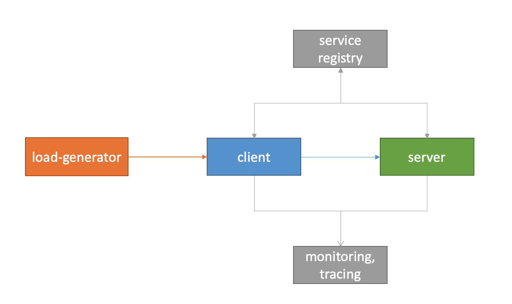
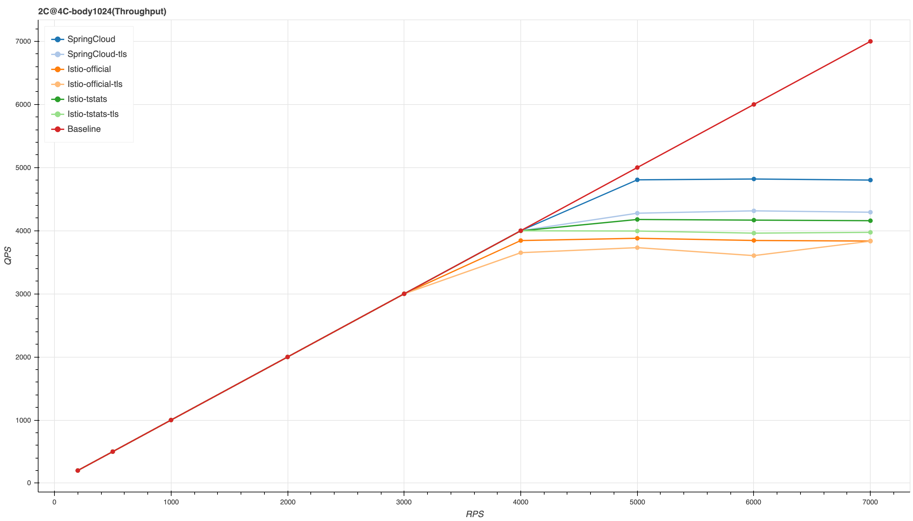
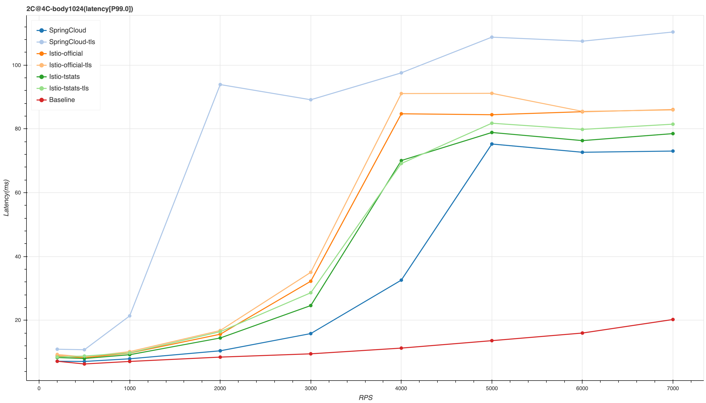
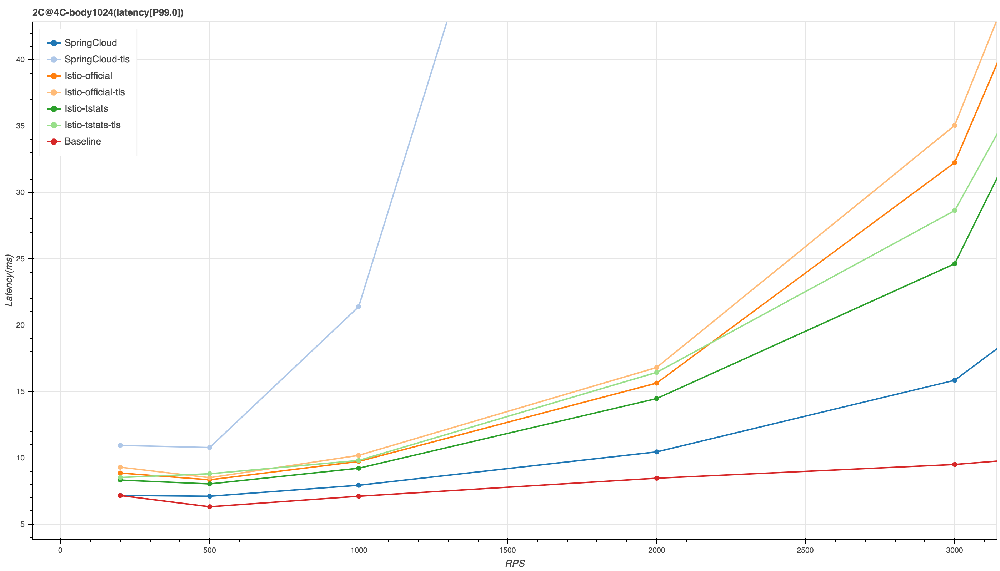
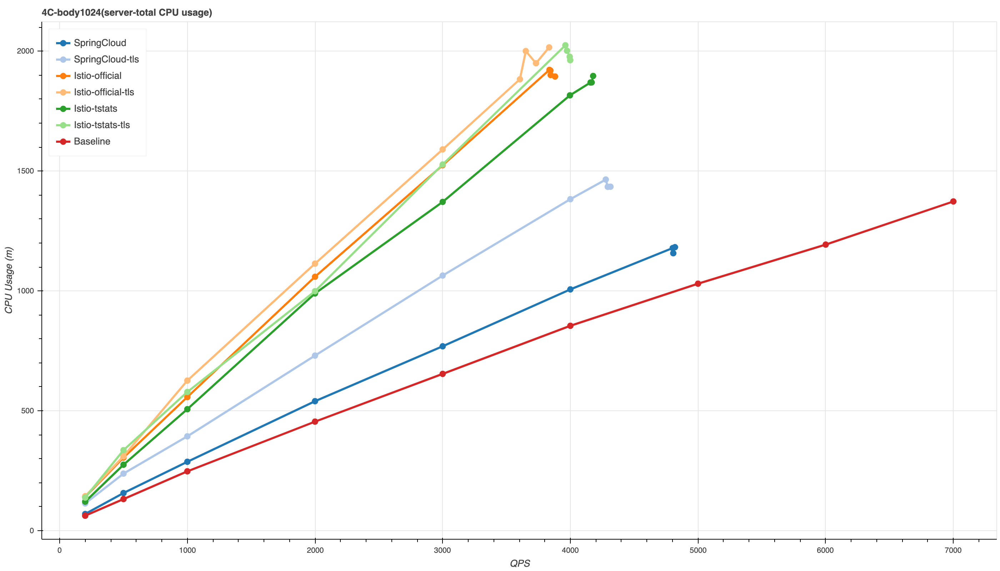
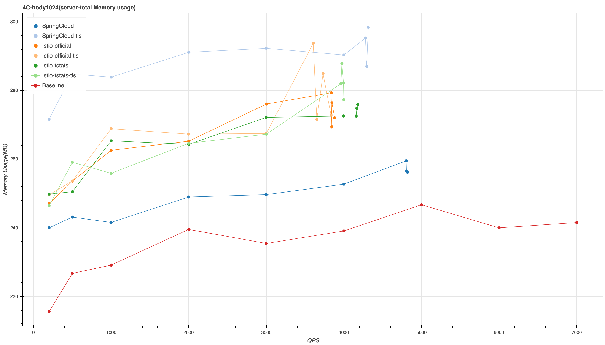
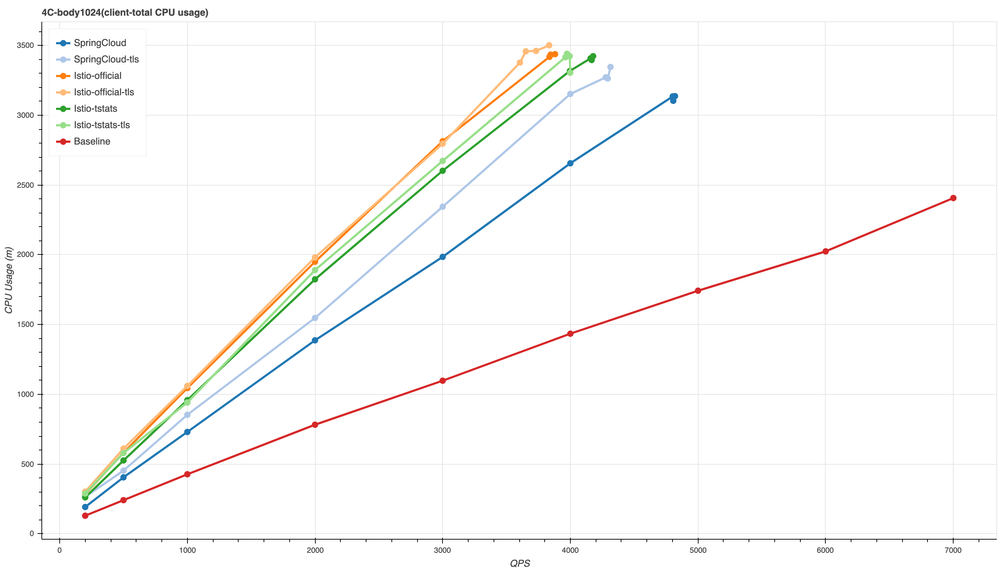
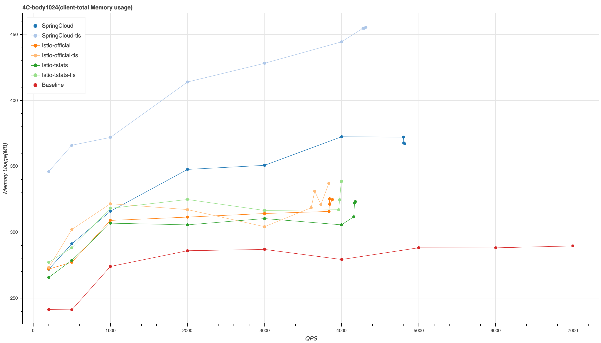

---

title: Spring Cloud与 Istio的性能测试对比
draft: true
date: 2020-05-10T17:43:24+08:00
tags: [Istio, Performance, Sidecar, SpringCloud]
categories: [servicemsh]
author: "penglei"

---

Spring Cloud 是基于JVM生态的微服务架构解决方案，在行业内使用非常广泛。Spring Cloud通过SDK提供服务注册、服务发现、遥测监控、链路跟踪等服务治理的功能，Istio通过sidecar模式提供服务治理功能。sidecar模式的性能一直为人诟病，通过下面的测试，我们获得了两者的性能差异。

## 一、测试方案

使用Java构建一个echo服务以及调用该服务的client。负载生成工具访问client，client调用server中的echo服务。在标准模式和网格测试的两种测试场景中，client和server会访问服务注册中心、链路跟踪服务。

**测试架构：**

对比三大测试场景：

* 基准测试 （Baseline）
    基准测试只使用Spring Cloud的脚手架，不使用服务注册、遥测监控、链路追踪功能。client使用固定的服务地址与server进行通信，没有额外消耗。

* 标准测试（SpringCloud）
    在基准测试的基础上，使用Spring Cloud生态的组件实现服务治理（ Eureka完成服务注册/服务发现，Sleuth上报链路跟踪信息，Prometheus SDK生成遥测指标）。

* 网格测试（Istio）
    在基准测试的基础上，引入Istio实现服务治理。

在每种测试场景中，增加了细化的TLS对比。对于网格测试场景，额外增加了优化版遥测和官方版遥测的对比。

**测试环境：**

client和server都运行于S2.LARGE8 (4C4)服务器上，所有机器都使用TKE进行管理，控制压测服务的运行过程。
测试过程中JVM和Envoy都自由使用CPU/Memory，不做限制。Spring Cloud底层使用的是tomcat，根据该环境的
测试经验，设置线程数为75。所有测试结果都是在JVM充分预热之后，采集稳定运行时段的数据获得。

## 二、测试结果

对于三种测试场景，都以RPS为变量进行了多次测试。我们选择了这些 RPS (200, 500, 1000, 2000, 3000, 4000, 5000, 6000, 7000) 模拟不同的压力进行测试。测试获取到 实际QPS、Client CPU/Memory、Server CPU/Memory、E2E延时数据。

1. 最大吞吐能力
    压测工具使用固定的RPS对client施加压力，得到实际处理的请求量（在这里用QPS表示）。下图中横坐标是压测RPS，纵坐标是系统实际QPS。在低于4000 RPS时，Spring Cloud和Istio都能完全处理请求，三条曲线重合。压力增加到5000 RPS时，Spring Cloud和Istio两种模式无法处理所有的请求，达到上限。
    
    *测试压力到5000 RPS时，Baseline可以完全处理，Spring Cloud实际QPS下降到4800左右，Istio则下降到4200左右。*

2. 终端延时（P99）
    
    *RPS超过3000时，延时明显增加，超过5000时达到机器处理上限。 SpringCloud增加TLS后，延时变得很差。*

   上图中可以看出Istio对延时的影响更明显，测试环境用的4C机器，超过3000QPS的数据没有太大意义，低QPS下Istio与Spring Cloud的延时对比更具有价值：
   
    **随着压力的上升，Istio对延时的影响更加明显。**
    _1000 QPS下，SpringCloud在Baseline的基础上增加1ms延时，Istio在Baseline的基础上增加2ms延时；_
    _2000 QPS下，SpringCloud在Baseline的基础上增加2ms延时，Istio在Baseline的基础上增加 6ms延时；_
    _3000 QPS下，SpringCloud在Baseline的基础上增加6.3ms延时，Istio在Baseline的基础上增加 15ms延时；_

3. server资源消耗
    测试架构中的server侧主要提供接口服务，服务治理的逻辑比较简单（不用初始化链路跟踪信息，不访问其它服务），最能体现不同的服务治理方式消耗的资源量。
    **注：下面的图表中不再以请求RPS为横坐标，而是以实际QPS为横坐标。**

    * CPU消耗：
        
        _CPU消耗与QPS呈正比关系。每1000QPS，SpringCloud额外消耗0.04 vCPU，Istio-tstats额外消耗 0.26 vCPU。_
        **SpringCloud额外消耗的资源较少，但增加TLS之后消耗明显增加。**

    * Memory消耗：
        
        _增加TLS后，SpringCloud消耗的内存较多_

4. client资源消耗
    测试架构中的client侧是流量入口，它的角色类似于Ingress Gateway，对应Spring Cloud社区有Zuul或者 Spring Cloud Gateway，client需要生成链路跟踪的信息（如Span ID等）、修改HTTP协议头、执行负载均衡策略，因此占用的资源比server侧更多。
    **注：下面的图表中不再以请求RPS为横坐标，而是以实际QPS为横坐标。**
    
    * CPU消耗：
        
        **每1000QPS，SpringCloud额外消耗0.3 vCPU，Istio-tstats额外消耗0.53vCPU。**
    * Memory消耗
        
        **client侧Sprin Cloud相比Istio-tstats要多消耗一些内存（10MB~50MB），增加TLS后，SpringCloud消耗较多内存**

## 三、总结

Spring Cloud使用SDK的方式实现服务治理，相比Istio使用sidecar模式，占用的CPU明显更少，每1000QPS，两者额外增加的CPU消耗分别为0.3vCPU和 0.83vCPU。SpringCloud使用TLS较复杂，需要侵入修改代码，没有Istio方便，并且TLS对SpringCloud性能影响较多。实际应用中，SpringCloud通常不会直接使用TLS。

总体而言，SpringCloud对延时的影响更小，消耗的资源更少，性能问题可能会成为SpringCloud用户迁移到Istio的重要障碍。
